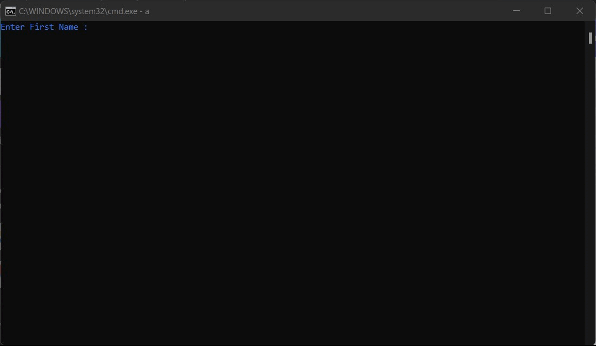

# Quizzz
This is an interactive console based quizz application. A user can play this game where he will be presented with questions on screen console with four options to choose from in a given time shown by the timer on the screen, if a user chooses right answer in given time then, he will be awarded some points else the game will terminate.

### RULES
* The questions are sorted in icreasing order of difficulty hence more time and points will be given and awarded respectively as user proceeds further in the game.
* The user should answer in the given time shown by the timer on the screen or else game will terminate automatically and no points will be awarded.
* Pressing any key other than valid one (1, 2, 3 and 4) will be counted as wrong answer. 

*The presented questions in quiz will be of core CS fundamental like Database Management System, Operating System and Networking* :) 

### GLANCE

  <!--  -->
  
  <!--  -->

